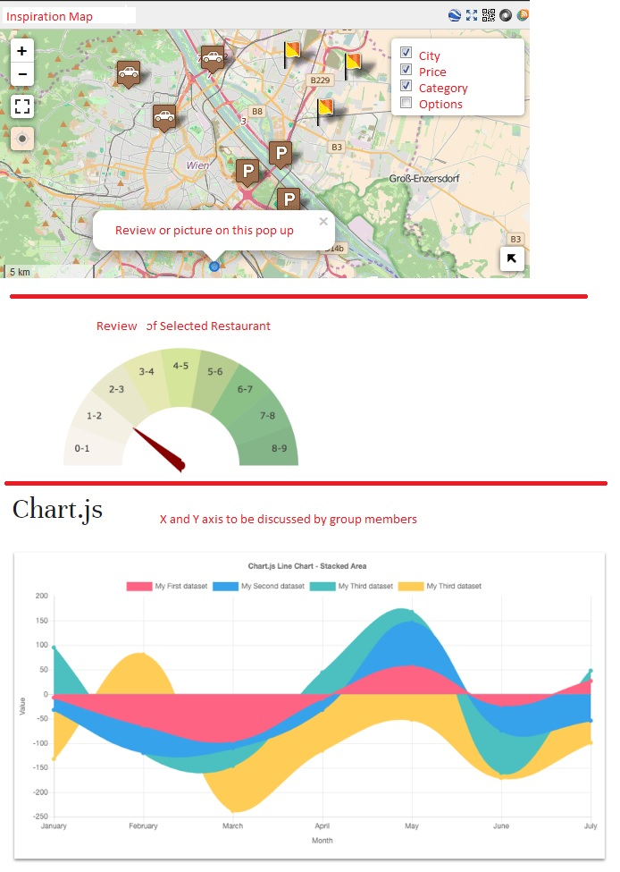

# Project Name: EATinerary
## Members: Brian Haley and Anna Francesca Gatus

In this present generation, there exists a distinct hobbyist group called foodies. These are people who eat not only out of necessity but also for passion to savor a multitude of taste and flavors. They have a strong social media presence that shows off mouth-watering photos and videos of food and where they grab it.

Aside from these foodies, a growing number of consumers dine at restaurants or order to go. We live in a fast-paced world and majority of people don’t have time nor inclination to cook. They barely have time to spare on researching eateries and menus. 

Although the food service industry looks promising due to increased demand, the unfortunate reality is that many restaurants fail in their first few years. A note-worthy reason for this could be lack of planning and research. 

In order to help both consumers and businesses alike, we gathered Yelp’s dataset to build an interactive dashboard page. The visualizations such as table, map and chart are customizable to meet the specific needs of foodies, non-foodies and businesses alike. User-input will make consumer and business research quick and easy. Filtering by location, cuisine, price category and other options such as wheelchair access, gender neutral washrooms etc, will prove very useful for targeting specific consumer needs and niche marketing. Afterall, no single restaurant has a universal appeal. 

Below are our inspiration / planned visualizations with some notes in red font:

 

Will use one of these JS libraries not covered in class:
* Sweetalert2 (pop-up library) - https://sweetalert2.github.io/
* Popmotion -  https://popmotion.io/pure/
* Typed.js - https://mattboldt.com/typed.js/
